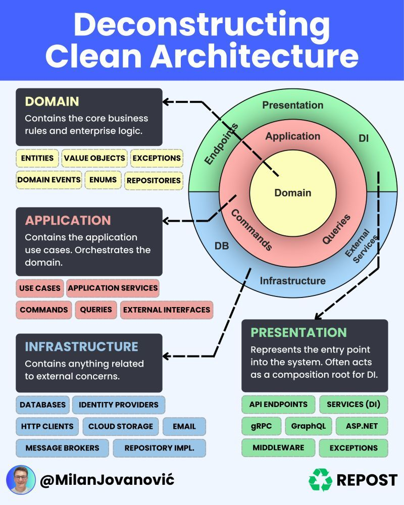

# Clean Architecture 

La **Clean Architecture**, propuesta por Robert C. Martin (Uncle Bob), busca separar los componentes de un sistema en capas independientes, de forma que cada una tenga una responsabilidad clara y el flujo de dependencias siempre vaya desde el exterior hacia el centro.



---
## Estructura de Carpetas

```
proyecto/
├── cmd/                  # Punto de entrada de la aplicación
├── internal/             # Lógica del dominio y de aplicación
│   ├── domain/           # Entidades y contratos (Enterprise Rules)
│   ├── usecases/         # Casos de uso (Application Rules)
│   ├── adapters/         # Adaptadores de interfaz (Controllers, Repos)
│   └── infrastructure/   # Implementaciones externas (DB, Web, etc)
├── pkg/                  # Librerías reutilizables
└── docs/                 # Documentación
```

---

## DOMAIN
**Contiene las reglas de negocio puras** del sistema. Es el núcleo de la arquitectura.

Elementos clave:
- **Entities**: Objetos del dominio con identidad propia y lógica de negocio.
- **Value Objects**: Objetos sin identidad, inmutables, que representan conceptos.
- **Domain Events**: Eventos que representan algo que ocurrió dentro del dominio.
- **Enums & Exceptions**: Tipos fuertes y errores específicos del dominio.
- **Repositories (Interfaces)**: Contratos para acceso a datos.

No depende de ninguna tecnología o librería externa.

---

## APPLICATION
Encapsula los **casos de uso del sistema**. Orquesta las entidades del dominio para cumplir una acción.

 Elementos clave:
- **Use Cases**: Lógica específica de aplicación (ej: registrar usuario).
- **Application Services**: Coordinan el uso de entidades/repositorios.
- **Commands / Queries**: Modelos para entrada/salida (estilo CQRS).
- **External Interfaces**: Interfaces hacia infraestructura (ej: repositorios, servicios).

Aquí se toman decisiones de flujo y validación de negocio, sin saber nada de frameworks.

---

## INFRASTRUCTURE
Se encarga de **las dependencias externas** al sistema.

Elementos clave:
- **Databases / Repository Implementations**: Implementación de acceso a datos.
- **HTTP Clients / Email / Cloud Storage**: Servicios externos.
- **Message Brokers**: Comunicación asíncrona.
- **Identity Providers**: Autenticación/autorización.

Esta capa puede cambiar sin tocar el núcleo del sistema gracias a las interfaces.

---

## PRESENTATION
Es el **punto de entrada** al sistema. Define cómo se reciben y responden las solicitudes.

Elementos clave:
- **API Endpoints / GraphQL / gRPC**: Interfaces expuestas al cliente.
- **ASP.NET / Middleware**: Frameworks y componentes del entorno.
- **Services (DI)**: Configuración de inyección de dependencias.
- **Exceptions**: Manejo de errores presentables.

Actúa como "composición raíz" del sistema, donde se conectan los casos de uso con los adaptadores reales.


## 📁 Descripción de Capas y Responsabilidades

### 1. `domain/` - Enterprise Business Rules
**Responsabilidad:** Modelar las entidades del negocio y sus reglas.

Contiene:
- Entidades puras del negocio
- Validaciones de dominio
- Contratos (interfaces) de repositorios

Ejemplo: `User`, `Product`, `Order`, etc.

#### Ejemplo:
```go
// internal/usecases/user_usecase.go
package usecases

import (
    "errors"
    "project/internal/domain"
)

type UserRepository interface {
    Save(user domain.User) error
}

type UserUseCase struct {
    repo UserRepository
}

func NewUserUseCase(r UserRepository) *UserUseCase {
    return &UserUseCase{repo: r}
}

func (uc *UserUseCase) Register(email, name string) error {
    user := domain.User{Email: email, Name: name}
    if !user.IsValid() {
        return errors.New("invalid user")
    }
    return uc.repo.Save(user)
}
```

### 2. `usecases/` - Application Business Rules
**Responsabilidad:** Coordinar la ejecución de acciones del negocio.

Contiene:
- Lógica de casos de uso
- Orquestación entre entidades y adaptadores
- Validaciones específicas de la aplicación

Ejemplo: `RegisterUser`, `DeleteOrder`, `UpdateProfile`

#### Ejemplo:
```go
// internal/usecases/user_usecase.go
package usecases

import (
    "errors"
    "project/internal/domain"
)

type UserRepository interface {
    Save(user domain.User) error
}

type UserUseCase struct {
    repo UserRepository
}

func NewUserUseCase(r UserRepository) *UserUseCase {
    return &UserUseCase{repo: r}
}

func (uc *UserUseCase) Register(email, name string) error {
    user := domain.User{Email: email, Name: name}
    if !user.IsValid() {
        return errors.New("invalid user")
    }
    return uc.repo.Save(user)
}
```

### 3. `adapters/` - Interface Adapters
**Responsabilidad:** Adaptar datos entre el mundo exterior y la lógica interna.

Contiene:
- Controladores HTTP
- Presentadores/serializadores
- Implementaciones concretas de interfaces (repositorios, gateways)

Ejemplo: `UserController`, `UserRepositoryMySQL`, `UserJSONPresenter`

#### Ejemplo:
```go
// internal/adapters/http/user_handler.go
package http

import (
    "encoding/json"
    "net/http"
    "project/internal/usecases"
)

type UserHandler struct {
    UC *usecases.UserUseCase
}

func (h *UserHandler) RegisterUser(w http.ResponseWriter, r *http.Request) {
    var req struct {
        Email string `json:"email"`
        Name  string `json:"name"`
    }
    _ = json.NewDecoder(r.Body).Decode(&req)
    err := h.UC.Register(req.Email, req.Name)
    if err != nil {
        http.Error(w, err.Error(), http.StatusBadRequest)
        return
    }
    w.WriteHeader(http.StatusCreated)
}
```

### 4. `infrastructure/` - Frameworks & Drivers
**Responsabilidad:** Implementaciones técnicas concretas, como DB, routers, etc.

Contiene:
- Configuración de base de datos
- Inicialización de servidor HTTP
- Conexiones externas (APIs, correo, archivos, etc)

Ejemplo: `MySQLConnection`, `GinRouter`, `MailProvider`

#### Ejemplo:
```go
// internal/infrastructure/mysql/user_repository.go
package mysql

import (
    "database/sql"
    "project/internal/domain"
)

type MySQLUserRepository struct {
    DB *sql.DB
}

func (r *MySQLUserRepository) Save(user domain.User) error {
    _, err := r.DB.Exec("INSERT INTO users (email, name) VALUES (?, ?)", user.Email, user.Name)
    return err
}
```


---