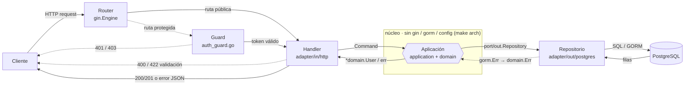

# Arquitectura Hexagonal (Puertos y Adaptadores)

El proyecto sigue **Arquitectura Hexagonal**, propuesta por Alistair Cockburn: el núcleo del sistema (dominio + casos de uso) queda aislado de la tecnología con la que se comunica hacia afuera (HTTP, base de datos, criptografía) a través de contratos explícitos — **puertos** — implementados por **adaptadores** intercambiables.

---

## Flujo de una petición

Toda petición HTTP recorre las mismas capas, sin importar el módulo. Las líneas punteadas marcan los dos casos especiales: un corte por error que responde directo al cliente sin llegar al núcleo, y los dos únicos puntos donde un error de infraestructura se traduce a un error de dominio (o de dominio a HTTP).



El Guard solo se ejecuta en rutas protegidas (por ejemplo `GET/PUT/DELETE /users`, no en `POST /users` ni `/login`). Un token inválido en el Guard o un body inválido en el Handler cortan la petición ahí mismo — nunca llegan a `application`. El Repositorio traduce `gorm.ErrRecordNotFound` (y errores similares) a un sentinel de `domain`; el Handler traduce ese sentinel a un `httpx.AppError`. Nada entre esos dos puntos conoce GORM ni el formato de respuesta HTTP.

Dos ejemplos reales del mismo camino:

| Petición | Códigos posibles | Nota |
|---|---|---|
| `POST /api/v1/users` | `201` creado · `422` validación · `409` email duplicado | Ruta pública, sin Guard. El `409` sale de `application` (`domain.ErrEmailTaken`), no de la base de datos. |
| `GET /api/v1/users/:id` | `200` ok · `401` sin token · `403` rol incorrecto · `404` no encontrado | Pasa por el Guard primero. El `404` nace como `gorm.ErrRecordNotFound` en el Repositorio y llega traducido hasta el cliente. |

---

## Estructura por módulo

Cada módulo de negocio (`auth`, `users`, `verification`) vive bajo `internal/<modulo>/` con esta forma:

```
internal/<modulo>/
├── domain/               # Entidad pura + sentinelas de error (Enterprise Rules)
├── port/
│   ├── in/                # Puerto de entrada: lo que el módulo OFRECE
│   └── out/                # Puertos de salida: lo que el módulo NECESITA
├── application/             # Implementa port/in, orquestando entidades vía port/out
├── adapter/
│   ├── in/http/               # Adaptador de entrada: handlers Gin, DTOs, rutas
│   └── out/postgres/           # Adaptador de salida: repositorio GORM + modelo de persistencia
└── <modulo>_module.go            # Composition root del módulo
```

---

## Las piezas

### `domain/`
Entidad de negocio y sus invariantes, sin ninguna dependencia de infraestructura: sin tags `json:`, sin tags `gorm:`, sin `TableName()`, sin `gin.Context`. Solo `errors.go` con sentinelas (`ErrUserNotFound`, `ErrEmailTaken`, ...) y, cuando aplica, un `ValidationError` con el mapa de campos inválidos.

### `port/in/`
La interfaz que el módulo expone hacia sus consumidores (típicamente el adaptador HTTP), más los *commands*/*queries* que transportan su entrada. Ejemplo: `users/port/in.UserService` con `CreateUserCommand`, `UpdateUserCommand`.

### `port/out/`
Las interfaces que la aplicación necesita del mundo exterior: un repositorio, un hasher de contraseñas, un emisor de tokens. **El puerto lo define quien lo consume** — por eso `users/port/out.PasswordHasher` (un método: `Hash`) y `auth/port/out.PasswordVerifier` (un método: `Matches`) son interfaces distintas aunque las satisfaga el mismo adaptador (`*security.BcryptHasher`): cada módulo pide exactamente lo que usa, ni más ni menos (Interface Segregation).

### `application/`
Implementa `port/in` orquestando la entidad de dominio a través de `port/out`. **Nunca importa `gin`, `gorm`, `finanzas-api/config` ni `internal/httpx`** — esto se verifica automáticamente con `make arch`. Aquí viven las decisiones de flujo (¿el email ya existe? ¿hay que rehashear la contraseña?), no la tecnología.

### `adapter/in/http/`
Traduce HTTP ⇄ dominio: define los DTOs de request/response (con sus tags `json:`/`binding:`, que aquí sí son apropiados), llama al puerto de entrada, y traduce los errores de dominio a `httpx.AppError` (`toAppError`, en `errors.go` de cada adaptador). Es el único lugar del módulo que conoce Gin.

### `adapter/out/postgres/`
Implementa `port/out` contra GORM. Tiene su **propio modelo de persistencia** (`userModel`, `verificationModel`, ...) con tags `gorm:` — nunca la entidad de dominio directamente — y mappers `toDomain`/`toModel` explícitos. Aquí es donde se traduce `gorm.ErrRecordNotFound` al sentinel de dominio correspondiente; el error de GORM nunca sale de este paquete.

### `<modulo>_module.go`
El composition root del módulo: construye el adaptador de salida, se lo inyecta a `application`, construye el adaptador de entrada con el resultado. Es el único archivo del módulo que conoce tanto el puerto como el adaptador concretos.

---

## Un ejemplo de puerto

```go
// internal/users/port/out/user_repository.go
package out

type UserRepository interface {
    Save(ctx context.Context, u *domain.User) error
    FindByID(ctx context.Context, id uuid.UUID) (*domain.User, error)
    ExistsByEmail(ctx context.Context, email string) (bool, error)
    // ...
}
```

```go
// internal/users/application/user_service.go
package application

type userService struct {
    repo   out.UserRepository   // puerto, no *gorm.DB
    hasher out.PasswordHasher   // puerto, no bcrypt directo
}
```

```go
// internal/users/adapter/out/postgres/user_repository.go
package postgres

func NewUserPostgresRepository(db *gorm.DB) out.UserRepository {
    return &userPostgresRepository{db: db}
}
```

`application` nunca ve `*gorm.DB`; solo conoce `out.UserRepository`. Cambiar de Postgres a otra base de datos, o sustituir el repositorio por un stub en un test, no toca una sola línea de `application/` ni de `domain/`.

---

## Cómo dos módulos se comunican entre sí

`auth` necesita leer credenciales de usuario, pero **no** importa el paquete de persistencia de `users` (eso sería infraestructura importando infraestructura, y acoplaría los dos módulos a nivel de esquema). En su lugar, `auth` define su propio puerto de salida —`auth/port/out.UserFinder`— y su propio adaptador —`auth/adapter/out/postgres/user_credentials_repository.go`—, una proyección de solo lectura sobre la misma tabla `users`. La fuente de verdad del esquema sigue siendo `db/migrations/users.sql`.

El mismo principio protege el guard de autenticación: `internal/auth/adapter/in/http/auth_guard.go` se expone a otros módulos como `httpx.AuthGuard` (un tipo función declarado en el paquete compartido `internal/httpx`), así que `users` y `verification` protegen sus rutas sin importar el paquete `auth`.

---

## Verificación automática

```bash
make arch
```

Falla si algún archivo bajo `internal/*/domain`, `internal/*/application` o `internal/*/port` importa `gin`, `gorm`, `finanzas-api/config` o `internal/httpx`. Se ejecuta como parte de `make lint` y por tanto en CI (`.github/workflows/go-ci.yml`).
